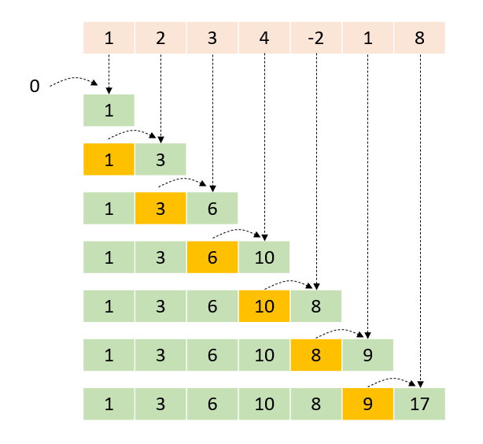
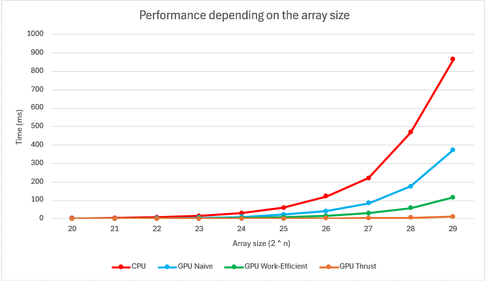

CUDA Stream Compaction
======================

**University of Pennsylvania, CIS 565: GPU Programming and Architecture, Project 2**

* Kyrylo Smyrnov
  * [LinkedIn](https://www.linkedin.com/in/kissmyrnov/)
* Tested on:
  * OS: Windows 11 
  * CPU: Intel Core i5-14400F
  * GPU: NVIDIA GeForce RTX 3060 Ti
  * RAM: 32 GB

## Introduction
Cumulative sum, also known as prefix sum or scan, of the input range and writes the result to the output range. Each element of the output range contains the running total of all earlier elements using the given binary operator for summation.

* Inclusive scan - the current item is included in the sum.
* Exclusive scan - the current item is not included in the sum.



Inclusive Scan | [Source](https://taskflow.github.io/taskflow/CUDASTDScan.html)

## Features

### Common
* `StreamCompaction::Common::kernMapToBoolean`: Helper function that maps an array to an array of 0s and 1s for stream compaction. Elements which map to 0 will be removed, and elements which map to 1 will be kept.
* `StreamCompaction::Common::kernScatter`: Helper function that performs scatter on an array. That is, for each element in idata, if bools[idx] == 1, it copies idata[idx] to odata[indices[idx]].

### CPU scan and compaction:
* `StreamCompaction::CPU::scan`: Performs an exclusive scan (prefix sum) on the CPU. Iterates over the input array sequentially, accumulating sums into the output array. Runs in O(n) time complexity. 
* `StreamCompaction::CPU::compactWithoutScan`: Performs stream compaction on the CPU without using scan. Iterates through the input array and copies only nonzero elements to the output array in O(n) time. Returns the number of elements kept.
* `StreamCompaction::CPU::compactWithScan`: Performs stream compaction on the CPU using exclusive scan. First, it computes a scan of a boolean mask (where nonzero elements are mapped to 1), then scatters the nonzero elements to their correct positions. Runs in O(n) time and returns the number of elements kept.

### GPU Naive approach:
* `StreamCompaction::Naive::scan`: Performs an exclusive scan on the GPU using an iterative Hillis-Steele algorithm. Runs in O(n log n) time by computing partial sums in parallel over multiple iterations.


Hillis-Steele scan | [Source](https://developer.nvidia.com/gpugems/gpugems3/part-vi-gpu-computing/chapter-39-parallel-prefix-sum-scan-cuda)

### GPU Work-efficient approach:
* `StreamCompaction::Efficient::scan`: Performs an exclusive scan on the GPU using the work-efficient Blelloch scan (upsweep and downsweep). The input is padded to the next power of two, ensuring proper binary tree structure. Runs in O(n log n) time.
  * Upsweep phase: Builds a hierarchical sum structure in place.
  * Set last element to zero
  * Downsweep phase: Propagates correct prefix sums down the tree.


Blelloch scan (Upsweep phase) | [Source](https://developer.nvidia.com/gpugems/gpugems3/part-vi-gpu-computing/chapter-39-parallel-prefix-sum-scan-cuda)


Blelloch scan (Downsweep phase) | [Source](https://developer.nvidia.com/gpugems/gpugems3/part-vi-gpu-computing/chapter-39-parallel-prefix-sum-scan-cuda)

* `StreamCompaction::Efficient::compact`: Performs stream compaction on the GPU using scan-based filtering. Runs in O(n log n) time.
  * Step 1: Maps the input to a boolean array (1 for nonzero, 0 for zero).
  * Step 2: Computes an exclusive scan on the boolean array to get output indices.
  * Step 3: Uses scatter to copy nonzero elements to their compacted positions.


Scan and scatter | [Source](https://developer.nvidia.com/gpugems/gpugems3/part-vi-gpu-computing/chapter-39-parallel-prefix-sum-scan-cuda)

### GPU Thrust:
* `StreamCompaction::Thrust::scan`: Performs an exclusive scan on the GPU using Thrust’s built-in exclusive_scan function. This implementation is highly optimized and runs in O(n) time using parallel primitives.

## Performance Analysis

The graph below illustrates the execution time (in milliseconds) of different scan implementations (CPU, GPU Naive, GPU Work-Efficient, and Thrust) across varying input array sizes.



Performance depending on the array size

* CPU: Linear time complexity O(n), but slower for large arrays due to sequential processing.
* GPU Naive (Hillis-Steele): Parallel but less efficient (O(n log n)), outperforming CPU for larger arrays but with higher overhead.
* GPU Work-Efficient (Blelloch): Optimized parallel approach O(n log n), showing better scalability than Naive.
* Thrust: NVIDIA’s highly optimized library O(n), demonstrating the fastest performance across all sizes.

## Example output

```
****************
** SCAN TESTS **
****************
Input:     [  28   0   0  41   2   8   9   0 ]
==== cpu scan, power-of-two ====
   elapsed time: 0.0001ms    (std::chrono Measured)
    [   0  28  28  28  69  71  79  88 ]
==== cpu scan, non-power-of-two ====
   elapsed time: 0ms    (std::chrono Measured)
    [   0  28  28  28  69 ]
    passed
==== naive scan, power-of-two ====
   elapsed time: 0.21504ms    (CUDA Measured)
    [   0  28  28  28  69  71  79  88 ]
    passed
==== naive scan, non-power-of-two ====
   elapsed time: 0.011264ms    (CUDA Measured)
    [   0  28  28  28  69   0   0   0 ]
    passed
==== work-efficient scan, power-of-two ====
   elapsed time: 0.082016ms    (CUDA Measured)
    [   0  28  28  28  69  71  79  88 ]
    passed
==== work-efficient scan, non-power-of-two ====
   elapsed time: 0.018432ms    (CUDA Measured)
    [   0  28  28  28  69 ]
    passed
==== thrust scan, power-of-two ====
   elapsed time: 0.075008ms    (CUDA Measured)
    [   0  28  28  28  69  71  79  88 ]
    passed
==== thrust scan, non-power-of-two ====
   elapsed time: 0.03088ms    (CUDA Measured)
    [   0  28  28  28  69 ]
    passed

*****************************
** STREAM COMPACTION TESTS **
*****************************
Input:     [   0   0   2   3   0   0   1   0 ]
==== cpu compact without scan, power-of-two ====
   elapsed time: 0.0002ms    (std::chrono Measured)
    [   2   3   1 ]
    passed
==== cpu compact without scan, non-power-of-two ====
   elapsed time: 0.0001ms    (std::chrono Measured)
    [   2   3 ]
    passed
==== cpu compact with scan ====
   elapsed time: 0.0007ms    (std::chrono Measured)
    [   2   3   1 ]
    passed
==== work-efficient compact, power-of-two ====
   elapsed time: 0.185344ms    (CUDA Measured)
    [   2   3   1 ]
    passed
==== work-efficient compact, non-power-of-two ====
   elapsed time: 0.069344ms    (CUDA Measured)
    [   2   3 ]
    passed
```

2^3 input array size, 256 block size. 